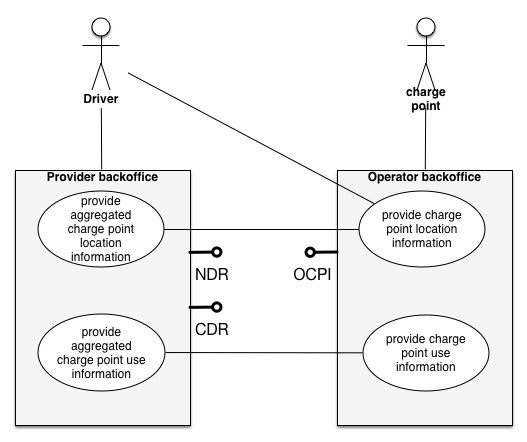

## Terminology and Data

**TAKEN FROM DRAFT V5 - TO BE UPDATED NOTES ON THE SECTIONS WHERE THE PROVIDED INFORMATION IS NOT TRUE ANY MORE TO REVIEW THE REST**

 * **OCPI** Open Charge point Interface 
 * **NDR** Notification Detail Record
 * **CDR** Charge Detail Record

### Overview

This overview shows the back-offices of the (service) provider and the (charge point) operator, including the role of the driver. 
OCPI is a stack of interfaces that enable a driver to find and make use of a chargepoint in an informed way. 

It all starts with finding a charge location that has a connector available that fulfills the needs of the driver. The 'Find' interface supports these actions in such a way that the driver is capable to query the operators on its own or via an aggregator like the provider.

When an applicable charge location is found, a spot at that location may be reserved - or - the driver is able to keep track of status changes on the availability at that charge location via the Subscription mechanism. 
Again, this may be done directly at the operator - or - via an aggregating service provided by the provider. 

The moment a driver starts charging the car, there may be smart-charging capabilities available or automatically enabled. The Authorization and Smart Charging interfaces support several situations to get a charge session started and the Subscription interface delivering notifications (NDR) will keep the driver informed on progress and possible issues during the charge session.

Finally at the end of a charge session, a billing record in the form of a CDR provides all details  and enables the complete financial handling of the full session. 

### Key concepts around a charge location

*Charge location* is an area that contains a number of charge points, all available via the same entry point. This allows simple aggregation for drivers and show locations that have at least a single connector of a specific type available. 

*Charge point* is a single physical device that contains possible authentication and authorization mechanisms. In practice this is the spot where a charge card is swiped. 

*EVSE* is the part that controls the power supply to a single EV in a single session. 

*Connector* is the socket available for the EV to make use of. A single EVSE may provide multiple sockets but only 1 of these sockets can be in use at the same time. 

### Callback interfaces

**TO BE UPDATED.**

All actions are initiated by the requesting party (mostly the provider) via the OCPI interface. A subscription 'call' tells the operator that this client  is interested in dynamic updates. When the operator allows the client to receive these updates, the operator will start pushing information towards the NDR and/or CDR interface endpoint as given by the client during the subscription call. 

### provider perspective

**TO BE UPDATED.**

The flow of a provider that makes use of these interfaces, will subscribe itself via the OCPI interface to dynamic events and CDR delivery. This allows the provider to specify own endpoints of the callback interfaces for both NDR and CDR messages. 
The provider will receive all generic NDR messages and specific NDR & CDR messages when their customer makes use of the charge points.

The provider may want to bundle all charge location information in order to deliver it in an aggregated way to the driver. 

### operator perspective

**TO BE UPDATED.**

The operator registers the providers that want to make use of the OCPI based information. 
Part of the information maybe public (static / availability information) and could do without registration. At least the driver usage needs to be protected and delivered only to a known identity. 

When a provider connects to OCPI and subscribes to the dynamic information, the operator pushes all defined information for a specific driver that is a customer of this specific provider. As the operator may need time to build the Charge Detail Records, these final statements of charge transactions may be delivered at a later stage. 

### driver perspective

A driver is able to make use of applications that connect via their provider to these interfaces or via a third party application that makes use of the OCPI interface in a direct way. 
Some of the interfaces will not be available to the driver, like the CDR interface.

### Smart charging support

The OCPI interfaces allows for smart charging.  The Provider as representative of the driver / customer is allowed to request a specific Charging Profile. The Operator evaluates this request and may change the charging profile provided to the car of the driver. The operator will notify the provider of its choice and actions via notifications.

This illustration shows the full flow for a smart charging situation. The communication between Provider and  Operator is in scope for the interfaces described in this document. 

### Message format

**TO BE UPDATED.**

The current structure of the interoperable interfaces is based on JSON. The message structure is based on the OCPP2 and OCHP standard when this is applicable. 

The OCPP2 standard is currently under development and will be available via the [Open Charge Alliance](http://www.openchargealliance.org/?q=node/9) See http://www.openchargealliance.org/?q=node/9 for more information. 

OCHP is an open protocol for clearing house functionality. More information is found at [OCHP](http://www.ochp.eu) See http://www.ochp.eu.

#### A note on variable naming

In order to prevent issues with Capitals in variable names, the naming in JSON is not CamelCase but camel_case. All variables are lowercase and include an underscore for a space. 

### Notes on generic data formats
#### Provider and Operator abbreviation
In this model, the provider and the operator play an important role. In order to target the right provider or operator, they need to be known upfront, at least between the cooperating parties. 

In several standards, an issuing authority is mentioned that will keep a central registry of known Providers and Operators. 
At this moment, Germany and The Netherlands have an authority that keeps track of the known providers and operators. 
The dutch foundation, named [eViolin](http://www.eviolin.nl) has no publication of this registry. 

The BDEW organisation keeps the registry for Germany. 

 * [Provider ID Liste](https://bdew-emobility.de/EMobility/ProviderIdList) See https://bdew-emobility.de/EMobility/ProviderIdList
 * [EVSE Operator ID Liste](https://bdew-emobility.de/EMobility/EvseOperatorIdList)  See https://bdew-emobility.de/EMobility/EvseOperatorIdList

In order to keep track of the currently known providers and operators in the Netherlands, a [seperate list](registry.md) is made available with this standard (for now). See https://github.com/thenewmotion/ocpi/blob/master/registry.md 

#### EVSEID
The EVSEID must follow the specification of ISO/IEC 15118-2 - Annex H ”Specification of Identifiers”.

The EVSEID must match the following structure (the notation corresponds to the augmented Backus-Naur Form (ABNF) as defined in RFC5234):

    <Country Code> <S> <EVSE Operator ID> <S> <ID Type> <Power Outlet ID>

* \<Country Code\>  2 ALPHA, two character country code according to ISO 3166-1 (Alpha-2-Code)
 * \<EVSE Operator ID\>  3 (ALPHA | DIGIT) three alphanumeric characters
 * \<ID Type\>  "E"; one character "E" indicating that this ID represents an "EVSE"
 * \<Power Outlet ID\>  (ALPHA | DIGIT) * 30 (ALPHA | DIGIT | \<S\> ) Sequence of alphanumeric characters or separators, start with alphanumeric character.
		* ALPHA = %x41-5A / %x61-7A; according to IETF RFC 5234 (7-Bit ASCII) DIGIT = %x30-39; according to IETF RFC 5234 (7-Bit ASCII)
		* \<S\> = *1 ( "*" | "-" ) Optional separator

An example for a valid EVSEID is FR-A23-E45B-78C with FR indicating France, A23 representing a particular EVSE Operator, E indicating that it is of type EVSE and 45B*78C representing its EVSEID.

EVSEID Semantics
The following rules apply:
 
 *  Each EVSEID has a variable length with at least seven characters (two characters Country Code, three characters EVSE Operator ID, one character ID Type, one character Power Outlet ID) and at most thirty-seven characters (two characters Country Code, three characters EVSE Operator ID, one character ID Type, thirty-one characters Power Outlet ID).
 *  While the EVSE Operator ID shall be assigned by a central issuing authority, each operator with an assigned EVSE Operator ID can choose the Power Outlet ID within the above mentioned rules freely.
 * A Power outlet ID is specified as a single unit that controls the chargesession (the actual EVSE)

Backward Compatibility EVSE-IDs as defined in DIN SPEC 91286 may be used by applying the following mapping:
 
 *  The two digit country code ”49” in Germany for geographic areas in ITU-T E.164:11/2010 is mapped onto the ISO-3166-1 (Alpha-2-Code).
 * The three digit of spot operator ID is mapped 1:1 into the new alphanumeric scheme.
 * All digits are mapped 1:1 into the new alphanumeric scheme. Example: +49*823*1234*5678 is interpreted as DE*823*E1234*5678

#### Contract ID 
The Contract ID is an unique identifier of a contract that is used to enable charging and related services. 

The Contract ID must match the following structure (the notation corresponds to the augmented Backus-Naur Form (ABNF) as defined in RFC5234):

    <Country Code> <S> <Provider ID> <S> <Instance> <S> <Check-Digit>
    
* \<Country Code\>  2 ALPHA, two character country code according to ISO 3166-1 (Alpha-2-Code)
* \<Provider ID\>  3 (ALPHA | DIGIT) three alphanumeric characters
* \<Instance\>  (ALPHA | DIGIT) * 9 (ALPHA | DIGIT \<S\> ) Sequence of alphanumeric characters or separators, start with alphanumeric character.
		* ALPHA = %x41-5A / %x61-7A; according to IETF RFC 5234 (7-Bit ASCII) DIGIT = %x30-39; according to IETF RFC 5234 (7-Bit ASCII)
		* \<S\> = *1 ( "*" | "-" ) Optional separator
* \<Check Digit\> 1 DIGIT; according to computation

##### Backward Compatibility 
Contract IDs as defined in DIN SPEC 91286 may be used as well by adding two zeros (”00”) at the beginning of the Instance-part and the old check digit at position 14. A second check digit as referenced in this document may be calculated over the resulting ID and may be added on position 15.
Example: The DIN Contract ID DE-8AA-123A56-3 must be set as EMAID DE-8AA-00123A563-N.

##### computation of the Check Digit
**TODO CHECK THIS**
*A unique value is determined for each of the first 11 characters of the Contract ID. The numbers (DIGIT) keep their value, the letters (ALPHA) are mapped to the values from A = 10 to Z = 35. 
The optional seperator \<S\> is not taken into account and the mapping is case insensitive, i.e. "D" as well as "d" maps to the value 13.*

In the resulting list of digits, each digit is multiplied with the weight of 2^\<pos\> (2 to the power of \<pos\>) where \<pos\> is the position in the list. The first value in the list is positioned on number 0 (zero)
The resulting products are summed up to \<checksum\>

Note: There are at least 11 (if only numbers (DIGIT) are used in the Contract ID) and at most 22 (if only letters (ALPHA) are used in the Contract ID) resulting products. 

Finally, \<checksum\> is taken "modulo  11". The result of this modulo-computation is a number between "0" and "10". The numbers between "0" and "9" are taken as Check Digit. For "10" the check digit is "X".

Note: Check digits based on the modulo-11 principle are able to idenitfy single typing errors as well as singled transposed characters. 

**TODO: ADD EXAMPLE HERE**
