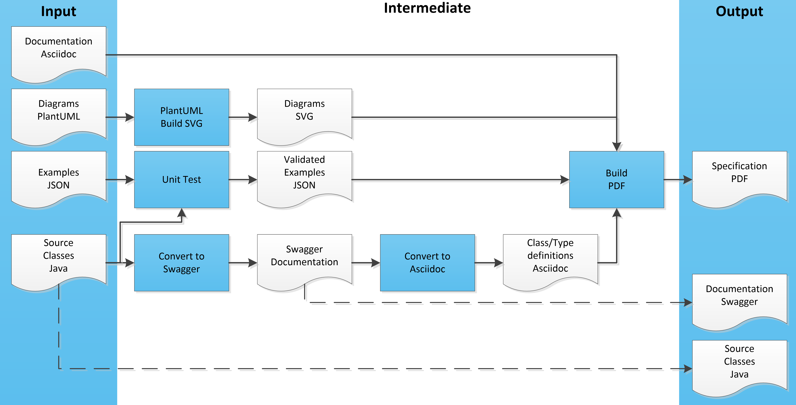

This branch contains the development of OCPI 3.0

The branch with the latest fixes to the 2.2 documentation is [`release-2.2-bugfixes`](https://github.com/ocpi/ocpi/tree/release-2.2-bugfixes)

The branch with the latest fixes to the 2.1.1-d2 documentation is [`release-2.1.1-bugfixes`](https://github.com/ocpi/ocpi/tree/release-2.1.1-bugfixes)

The `master` branch always contains the latest official release.

Development of the next version of OCPI, new functionality, is done in the  [`develop-3.0`](https://github.com/ocpi/ocpi/tree/develop-3.0) branch.

TODO Update readme.

## Contents

 * [__Version History__](_common/version_history.asciidoc)
 * [__Introduction__](A_introduction/introduction.asciidoc)
   - [Terminology and Definitions](A_introduction/terminology.asciidoc)
   - [Supported Topologies](A_introduction/topology.asciidoc)
 * __Protocol Meta Information__, describes the connections between the parties
   - [Transport and Format](C_transport_modules/transport_and_format.asciidoc)
   - [Status codes](C_transport_modules/status_codes.asciidoc)
   - [Version information endpoint](C_transport_modules/version_information_endpoint.asciidoc)
   - [Credentials & registration](C_transport_modules/credentials.asciidoc)
 * __Overview of Modules__, each section describes one module.
   - [Locations](C_transport_modules/mod_locations.asciidoc)
   - [Sessions](C_transport_modules/mod_sessions.asciidoc)
   - [CDRs](C_transport_modules/mod_cdrs.asciidoc)
   - [Tariffs](C_transport_modules/mod_tariffs.asciidoc)
   - [Tokens](C_transport_modules/mod_tokens.asciidoc)
   - [Commands](C_transport_modules/mod_commands.asciidoc)
   - [Charging Profiles](C_transport_modules/mod_charging_profiles.asciidoc)
   - [Hub Client Info](C_transport_modules/mod_hub_client_info.asciidoc)

 * __Generic Types__, describing all data types that are used by multiple objects
   - [Types](C_transport_modules/types.asciidoc)
 * [__Changelog__](C_transport_modules/changelog.asciidoc)

- Improvements from rel. 2.0
- Chargepoint commands
- realtime authorization
- fixes some bugs of 2.1 (2.1 is now deprecated)

Release 2.0: 

- Charge Point Exchange Static & Dynamic (with tariffing covering only start/kWh/time)
- Authorization & token data exchange
- Tariffing
- Session Info exchange (cdr & ndr)
- Registration (How to connect) & Security

__Planned releases:__

Release 2.2:

- Charging Profiles
- Preferences based Smart Charging
- Support for Hubs
- VAT
- Credit CDRs
- Improved Reservation support (Cancel & Tariff)
- Lots of minor improvements

__Building Process__:

The OCPI Build Process has been improved. OCPI 2.0/2.1.1 was in markdown format, and diagrams where Plantuml.

For OCPI 2.2, the text of OCPI has been converted to asciidoc. 
Asciidoc is easier to format the output, and chapter numbering and internal links are much easier to work with.

A lot of implementers asked for Swagger files, they will become available for OCPI 2.2 and onwards. 
We wanted to generate the specification and Swagger files from one source, 
so the different end-products: PDF and Swagger cannot be "out-of-sync". 

As a source, Java class files were created. 
The Java files are annotated so the Swagger tools can generate Swagger documentation from them. 
The Swagger documentation is then converted to asciidoc. 
This is only the Object/Class/Type/Enum definitions, not all the rest of the text.

The Plantuml is no longer converted to PNG images, but the SVG, making them much better readable, and even searchable in the PDF.

In OCPI 2.0 and 2.1.1, the JSON examples contained a lot of mistakes, where outdated compared to the text, or not even valid JSON. 
To prevent issues with the examples in the specification, the examples are not placed in separate JSON files. 
These files are check in a unit test, together with the Java source files. This way we know for sure that the JSON examples are valid OCPI.
In the PDF generation step, all the asciidoc files are merged into one file, 
this file is checked for broken internal links before the PDF is generated.
The final result that will be published: the PDF, the Swagger files and the Java source files. 
We hope the Swagger and Java files will decrease the development time and issues created by having to manually code all the OCPI classes and types. 
When needed, Swagger Codegen can be used by implementers to generate similar code for other programming languages.

----
1 Dec 2014 [Draft v4](releases/old/OCPI-Draftv4.pdf) is published
17 June 2015 [Draft v5] is moved to a new branch that will be used as a reference as the OCPI specifications are being redefined and the specifications are restructured in different files, a file per chapter
