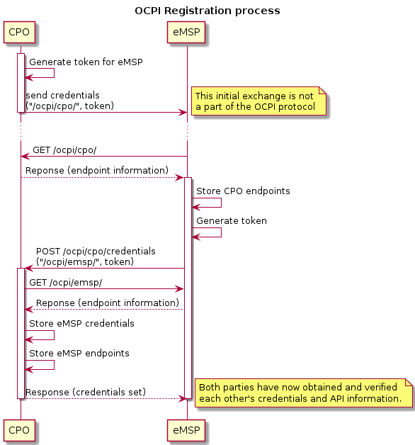
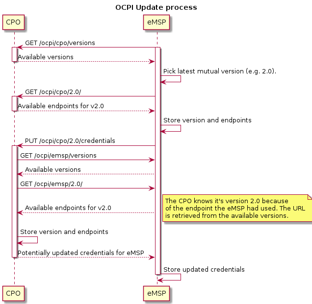

# Credentials endpoint

**Module Identifier: `credentials`**

## 1. Interfaces and endpoints

Example: `/ocpi/cpo/2.0/credentials` and `/ocpi/emsp/2.0/credentials`

<div><!-- ---------------------------------------------------------------------------- --></div>

| Method                      | Description                                                                                       |
|-----------------------------|---------------------------------------------------------------------------------------------------|
| [GET](#11-get-method)       | Retrieves the credentials object to access the server's platform.                                 |
| [POST](#12-post-method)     | Provides the server with a credentials object to access the client's system (i.e. register).      |
| [PUT](#13-put-method)       | Provides the server with an updated credentials object to access the client's system.             |
| PATCH                       | n/a                                                                                               |
| [DELETE](#14-delete-method) | Informs the server that its credentials to the client's system are now invalid (i.e. unregister). |
<div><!-- ---------------------------------------------------------------------------- --></div>


### 1.1 __GET__ Method

Retrieves the credentials object to access the server's platform. The request body is empty, the response contains the credentials object to access the server's platform. This credentials object also contains extra information about the server such as its business details.


### 1.2 __POST__ Method

Provides the server with credentials to access the client's system. This credentials object also contains extra information about the client such as its business details.

A `POST` initiates the registration process for this endpoint's version. The server must also fetch the client's endpoints for this version.

If successful, the server must generate a new token and respond with the client's new credentials to access the server's system. The credentials object in the response also contains extra information about the server such as its business details.

This must return a `HTTP status code 405: method not allowed` if the client was already registered.

### 1.3 __PUT__ Method

Provides the server with updated credentials to access the client's system. This credentials object also contains extra information about the client such as its business details.

A `PUT` will switch to the version that contains this credentials endpoint if it's different from the current version. The server must fetch the client's endpoints again, even if the version has not changed.

If successful, the server must generate a new token for the client and respond with the client's updated credentials to access the server's system. The credentials object in the response also contains extra information about the server such as its business details.

This must return a `HTTP status code 405: method not allowed` if the client was not registered yet.

### 1.4 __DELETE__ Method

Informs the server that its credentials to access the client's system are now invalid and can no longer be used. Both parties must end any automated communication. This is the unregistration process.

This must return a `HTTP status code 405: method not allowed` if the client was not registered.

<!--
  Add some whitelines for PDF generation fix, TODO check in new PDf versions 
-->

&nbsp;

&nbsp;

&nbsp;

&nbsp;

&nbsp;

<!--
  Add some whitelines for PDF generation fix, TODO check in new PDf versions 
-->

## 2. Object description

### 2.1 Credentials object

<div><!-- ------------------------------------------------------------------------------------------------------------------------------------------------------------------------------------ --></div>

| Property                 | Type                                                         | Card.  | Description                                                        |
|--------------------------|--------------------------------------------------------------|--------|--------------------------------------------------------------------|
| token                    | [string](types.md#15-string-type)(64)                        | 1      | The token for the other party to authenticate in your system.      |
| url                      | [URL](types.md#16-url-type)                                  | 1      | The URL to your API versions endpoint.                             |
| business_details         | [BusinessDetails](mod_locations.md#41-businessdetails-class) | 1      | Details of this party.                                             |
| party_id                 | [string](types.md#15-string-type)(3)                         | 1      | CPO or eMSP ID of this party. (following the 15118 ISO standard).  |
| country_code             | [string](types.md#15-string-type)(2)                         | 1      | Country code of the country this party is operating in.            |
<div><!-- ------------------------------------------------------------------------------------------------------------------------------------------------------------------------------------ --></div>

The `party_id` and `country_code` are provided here to inform a server about the `party_id` and `country_code` a client will use when pushing [client owned objects](transport_and_format.md#client-owned-object-push). This helps a server determine the URLs a client will use when pushing a [client owned object](transport_and_format.md#client-owned-object-push). 
The `country_code` is added the make certain the URL used when pushing a [client owned object](transport_and_format.md#client-owned-object-push) is unique, there might be multiple parties in the world with the same `party_id`, but the combination should always be unique.
A party operating in multiple countries can always use the home country of the company for all connections. For example: an OCPI implementation might push EVSE IDs from a company for different countries, preventing an OCPI connection per country a company is operating in.
The `party_id` and `country_code` give here, have no direct link with the eMI3 EVSE IDs and Contract IDs that might be used in the different OCPI modules. For example: an implementation OCPI might push EVSE IDs with a different eMI3 `spot operator`, then the OCPI `party_id` and/or different `country_code`.


### Example

```json
{
    "url": "https://example.com/ocpi/cpo/",
    "token": "ebf3b399-779f-4497-9b9d-ac6ad3cc44d2",
    "party_id": "EXA",
    "country_code": "NL",
    "business_details": {
        "name": "Example Operator",
        "logo": {
            "url": "https://example.com/img/logo.jpg",
            "thumbnail": "https://example.com/img/logo_thumb.jpg",
            "category": "OPERATOR",
            "type": "jpeg",
            "width": 512,
            "height": 512
        },
        "website": "http://example.com"
    }
}
```

## 3 Use cases

### 3.1 Registration

To register a CPO in an eMSP platform (or vice versa), the CPO must create a unique token that can be used for authenticating the eMSP. This token along with the versions endpoint should be sent to the eMSP in a secure way that is outside the scope of this protocol.

`TOKEN_A` is given offline, after registration store the `TOKEN_C` which will be used in future exchanges. 

(In the sequence diagrams below we use relative paths as short resource identifiers to illustrate a point; please note that they should really be absolute URLs in any working implementation of OCPI)



Due to its symmetric nature, the CPO and eMSP can be swapped in the registration sequence.

<!--
  Add some whitelines for PDF generation fix, TODO check in new PDf versions 
-->

&nbsp;

&nbsp;

<!--
  Add some whitelines for PDF generation fix, TODO check in new PDf versions 
-->

### 3.2 Updating to a newer version

At some point both parties will have implemented a newer OCPI version. To start using the newer version, one party has to send a PUT request to the credentials endpoint of the other party.




### 3.3 Changing endpoints for the current version

This can be done by following the update procedure for the same version. By sending a PUT request to the credentials endpoint of this version, the other party will fetch and store the corresponding set of endpoints.

### 3.4 Updating the credentials and resetting the token

The credentials (or parts thereof, such as the token) can be updated by sending the new credentials via a PUT request to the credentials endpoint of the current version, similar to the update procedure described above.

### 3.5 Errors during registration

When the Server connects back to the client during the credentials registration, it might encounter problems. When this happens, the Server should add the status code: [3001](status_codes.md#3xxx-server-errors) in the response to the POST from the client. 

### 3.6 Required endpoints not available

When two parties connect, it might happen that one of the parties expects a certain endpoint to be available at the other party. 

For example: a CPO could only want to connect when the CDRs endpoint is available in an eMSP system. 

In case the client is starting the credentials exchange process and cannot find the endpoints it expects, it is expected NOT to send the POST request with credentials to the server. Log a message/notify the administrator to contact the administrator of the server system.

In case the server, receiving the request from a client, cannot find the endpoints it expects, then it is expected to respond to the request with a status code: [3003](status_codes.md#3xxx-server-errors).
