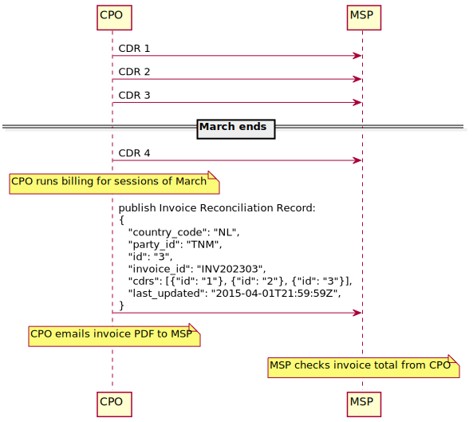
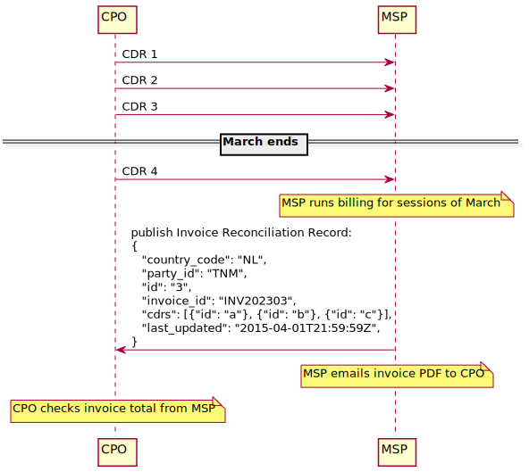

:numbered:
[[mod_invoice_reconciliation_module]]
== _Invoice Reconciliation_ module

*Module Identifier: `invoicereconciliation`*

*Data owner: `CPO` or `MSP`*

*Type:* Functional Module

Invoice Reconciliation enables Parties that receive invoices for Charging Sessions to check the amounts of these invoices against the CDR data that they transferred via OCPI. Invoice Reconciliation records are deliberately flexible so that Parties that invoice among each other, typically CPOs and EMPS, are free to decide:

* When they invoice (for example, with a monthly billing cycle or with a new invoice for every Charging Session)
* How they transfer the actual invoice documents (postal mail, e-mail, or purpose-made IT solutions)
* How they pay the invoices

[[mod_invoice_reconciliation_flow_and_lifecycle]]
=== Flow and Lifecycle

The workflow for invoice reconciliation will work somewhat differently depending on whether the invoicing Parties use _direct billing_ or _reverse billing_. Direct billing is the situation in which the Party who delivered the service, that is typically the CPO, sends invoices to the Party who consumed the service, that is typically the MSP. Reverse billing is the situation in which the Party who consumed the service, that is typically the MSP, sends invoices for credit amounts to the Party who delivered the service, that is typically the CPO.

With direct billing the flow for Invoice Reconciliation looks like this:

What we see here is a process with the following steps:

* The CPO conducts Charging Sessions and issues CDRs for them to the MSP
* At some point, at the CPO's discretion, the CPO runs billing and produces an invoice for the Charging Sessions. In the diagram, as an example, we assume that the CPO runs a monthly billing cycle and the end of the month of March is the trigger for them to produce an invoice.
* Once the CPO completes the invoice, it publishes an Invoice Reconciliation Record of it to the MSP
* Note that in the example, a CDR 4 is delivered between the moment March ends and the Invoice Reconciliation Record for the March invoice is published. It is published before the Invoice Reconciliation Record is published, but is nevertheless not mentioned in the Invoice Reconciliation Record and not invoiced by the invoice that the Invoice Reconciliation Record is about. This CDR 4 in the example serves to illustrate that the set of invoices referenced by an Invoice Reconciliation Record is not determined by timing, but by the list of invoice IDs in the Invoice Reconciliation Record.
* The CPO also delivers the invoice to the MSP. How precisely this happens is not relevant, as long as the MSP's staff are able to access the invoice document.
* When the MSP has both the Invoice Reconciliation Record and the invoice, they can easily reconcile by computing the total amount for the Invoice Reconciliation Record's CDRs in their own systems, and comparing this computed amount to the amount listed in the invoice document.

With reverse billing, the flow for Invoice Reconciliation looks like this:

We see here that the billing cycle is started at the MSP instead of the CPO, and from that point on, the communication pattern between the two Parties is exactly reversed compared to the direct billing scenario. Although accordingly the roles of Invoice Reconciliation Record sender and receiver are reversed among the CPO and the MSP, the very same technical OCPI interface can be used for both scenarios.

[[mod_invoice_reconciliation_push_model]]
==== Push model

When the CPO or eMSP creates Invoice Reconciliation records, they push them to the relevant parties by calling <<mod_invoice_reconciliation_receiver_post_method,POST>> on the Invoice Reconciliation endpoint with the newly created records.

Any changes to an Invoice Reconciliation record are sent to relevant parties by calling <<mod_invoice_reconciliation_receiver_put_method,PUT>> on the Invoice Reconciliation endpoint with the updated Invoice Reconciliation Record object.

When a CPO or eMSP deletes an Invoice Reconciliation record, they will call the <<mod_invoice_reconciliation_receiver_delete_method,DELETE>>

[[mod_invoice_reconciliation_pull_model]]
==== Pull model

Parties who do not support the Push model need to call
<<mod_invoice_reconciliation_sender_get_method,GET>> on the invoice reconciliation sender endpoint to receive a list of Invoice Reconciliation Records.

This <<mod_invoice_reconciliation_sender_get_method,GET>> can also be used in combination with the Push model to retrieve Invoice Reconciliation Records after the system (re-)connects, to get a list of Invoice Reconciliation Records _missed_ during a downtime.

[[mod_invoice_reconciliation_interfaces_and_endpoints]]
=== Interfaces and Endpoints

There are both, a Sender and a Receiver interface. Depending on business requirements, parties can decide to use
the Sender Interface (Pull model), or the Receiver Interface (Push model), or both.
Push is the preferred model to use, because the Receiver will receive Invoice Reconciliation Records in semi-realtime when they are created by either the CPO or eMSP.

[[mod_invoice_reconciliation_sender_interface]]
==== Sender Interface

When using the _direct billing_, this interface is typically implemented by market roles like the CPO. When using _reverse billing_ this interface is typically implemented by market roles like the eMSP.

The Invoice Reconciliation endpoint can be used to retrieve Invoice Reconciliation Records.

Endpoint structure definition:

`{invoice_reconciliation_endpoint_url}?[date_from={date_from}]&amp;[date_to={date_to}]&amp;[offset={offset}]&amp;[limit={limit}]`

Examples:

`+https://www.server.com/ocpi/cpo/2.2.1/invoicereconciliation/?date_from=2019-01-28T12:00:00&date_to=2019-01-29T12:00:00+`

`+https://ocpi.server.com/2.2.1/invoicereconciliation/?offset=50+`

`+https://www.server.com/ocpi/2.2.1/invoicereconciliation/?date_from=2019-01-29T12:00:00&limit=100+`

`+https://www.server.com/ocpi/cpo/2.2.1/invoicereconciliation/?offset=50&limit=100+`

[cols="2,12",options="header"]
|===
|Method |Description

|<<mod_invoice_reconciliation_sender_get_method,GET>> |Fetch InvoiceReconciliationRecords last updated (which in the current version of OCPI can only be the creation Date/Time) between the `{date_from}` and `{date_to}` (<<transport_and_format.asciidoc#transport_and_format_pagination,paginated>>).
|POST |n/a
|PUT |n/a
|PATCH |n/a
|DELETE |n/a
|===

[[mod_invoice_reconciliation_sender_get_method]]
===== *GET* Method

Fetch InvoiceReconciliationRecords

====== Request Parameters

If additional parameters: `{date_from}` and/or `{date_to}` are provided, only InvoiceReconciliationRecords with `last_updated`
between the given `{date_from}` (including) and `{date_to}` (excluding) will be returned.

This request is <<transport_and_format.asciidoc#transport_and_format_pagination,paginated>>, it supports the <<transport_and_format.asciidoc#transport_and_format_paginated_request,pagination>> related URL parameters.

[cols="3,2,1,10",options="header"]
|===
|Parameter |Datatype |Required |Description

|date_from |<<types.asciidoc#types_datetime_type,DateTime>> |no |Only return InvoiceReconciliationRecords that have `last_updated` after or equal to this Date/Time (inclusive).
|date_to |<<types.asciidoc#types_datetime_type,DateTime>> |no |Only return InvoiceReconciliationRecords that have `last_updated` up to this Date/Time, but not including (exclusive).
|offset |int |no |The offset of the first object returned. Default is 0.
|limit |int |no |Maximum number of objects to GET.
|===

====== Response Data

The endpoint returns a list of InvoiceReconciliationRecords matching the given parameters in the GET request, the header will contain the <<transport_and_format.asciidoc#transport_and_format_paginated_response,pagination>> related headers.

Any older information that is not specified in the response is considered no longer valid.
Each object must contain all required fields. Fields that are not specified may be considered as null values.

|===
|Datatype |Card. |Description
|<<mod_invoice_reconciliation_record_object,InvoiceReconciliationRecord>> |* |List of InvoiceReconciliationRecords.
|===

[[mod_invoice_reconciliation_receiver_interface]]
==== Receiver Interface

When using the _direct billing_, this interface is typically implemented by market roles like the eMSP. When using _reverse billing_ this interface is typically implemented by market roles like the CPO.

The InvoiceReconciliationRecords endpoint can be used to create and retrieve InvoiceReconciliationRecords.

InvoiceReconciliationRecords are <<transport_and_format.asciidoc#transport_and_format_client_owned_object_push,Client Owned Objects>>, so the endpoints need to contain the required extra fields: {<<credentials.asciidoc#credentials_credentials_object,party_id>>} and {<<credentials.asciidoc#credentials_credentials_object,country_code>>}.

Endpoint structure definition:

`{invoice_reconciliation_endpoint_url}`

Example:

`+https://www.server.com/ocpi/2.2.1/invoicereconciliation+`

[cols="2,12",options="header"]
|===
|Method |Description
|<<mod_invoice_reconciliation_receiver_get_method,GET>> |Retrieve an existing InvoiceReconciliationRecord.
|<<mod_invoice_reconciliation_receiver_post_method,POST>> |Send a new InvoiceReconciliationRecord.
|<<mod_invoice_reconciliation_receiver_put_method,PUT>> | Update an existing InvoiceReconciliationRecord.
|PATCH |n/a
|<<mod_invoice_reconciliation_receiver_delete_method,DELETE>> | Delete an existing InvoiceReconciliationRecord.
|===

[[mod_invoice_reconciliation_receiver_get_method]]
===== GET Method

Fetch an InvoiceReconciliationRecord from the receivers system.

====== Request Parameters

The following parameters SHALL be provided as URL segments.

[cols="3,2,1,10",options="header"]
|===
|Parameter |Datatype |Required |Description
|country_code |<<types.asciidoc#types_cistring_type,CiString>>(2) |yes |Country code of the CPO requesting data from the eMSP system.
|party_id |<<types.asciidoc#types_cistring_type,CiString>>(3) |yes |Party ID (Provider ID) of the CPO requesting data from the eMSP system.
|id |<<types.asciidoc#types_cistring_type,CiString>>(36) |yes | Identifier of the InvoiceReconciliationRecord object to retrieve.
|===

====== Response Data

The endpoint returns the requested InvoiceReconciliationRecord, if it exists.

|===
|Datatype |Card. |Description
|<<mod_invoice_reconciliation_record_object,InvoiceReconciliationRecord>> |1 |Requested InvoiceReconciliationRecord object.
|===

[[mod_invoice_reconciliation_receiver_post_method]]
===== POST Method

Creates a new InvoiceReconciliationRecord.

====== Request Body

In the POST request the new InvoiceReconciliationRecord object is sent.

[cols="4,1,12",options="header"]
|===
|Type |Card. |Description
|<<mod_invoice_reconciliation_record_object,InvoiceReconciliationRecord>> |1 |New InvoiceReconciliationRecord object.
|===

[[mod_invoice_reconciliation_receiver_put_method]]
===== *PUT* Method

Update an existing InvoiceReconciliationRecord.

====== Request Body

In the PUT request, the updated InvoiceReconciliationRecord object is sent in the body.

[cols="4,1,12",options="header"]
|===
|Type |Card. |Description
|<<mod_invoice_reconciliation_record_object,InvoiceReconciliationRecord>> | 1 | Updated InvoiceReconciliationRecord object.
|===

====== Request Parameters

The following parameters SHALL be provided as URL segments.

[cols="3,2,1,10",options="header"]
|===
|Parameter |Datatype |Required |Description
|country_code |<<types.asciidoc#types_cistring_type,CiString>>(2) |yes |Country code of the CPO requesting data from the eMSP system.
|party_id |<<types.asciidoc#types_cistring_type,CiString>>(3) |yes |Party ID (Provider ID) of the CPO requesting data from the eMSP system.
|id |<<types.asciidoc#types_cistring_type,CiString>>(36) |yes | Identifier of the InvoiceReconciliationRecord object to retrieve.
|===

[[mod_invoice_reconciliation_receiver_delete_method]]
===== *DELETE* Method

Delete an existing InvoiceReconciliationRecord.

====== Request Parameters

The following parameters SHALL be provided as URL segments.

[cols="3,2,1,10",options="header"]
|===
|Parameter |Datatype |Required |Description
|country_code |<<types.asciidoc#types_cistring_type,CiString>>(2) |yes |Country code of the CPO requesting data from the eMSP system.
|party_id |<<types.asciidoc#types_cistring_type,CiString>>(3) |yes |Party ID (Provider ID) of the CPO requesting data from the eMSP system.
|id |<<types.asciidoc#types_cistring_type,CiString>>(36) |yes | Identifier of the InvoiceReconciliationRecord object to retrieve.
|===

[[mod_invoice_reconciliation_objects]]
=== Object description

[[mod_invoice_reconciliation_record_object]]
==== _InvoiceReconciliationRecord_ Object

Represents a record used for reconciling invoices, containing an identifier for the invoice and the associated CDRs.

[cols="4,3,1,9",options="header"]
|===
| Property      |Type                                                   | Card. | Description
| country_code  |<<types.asciidoc#types_cistring_type,CiString>>(2)     | 1     | ISO-3166 alpha-2 country code of the party that 'owns' this record.
| party_id      |<<types.asciidoc#types_cistring_type,CiString>>(3)     | 1     | ID of the party that 'owns' this record.
| id            |<<types.asciidoc#types_cistring_type,CiString>>(36)    | 1     | Uniquely identifies an InvoiceReconciliationRecord.
| invoice_id    | <<types.asciidoc#types_cistring_type,CiString>>(255)  | 1     | An identifier identifying an invoice sent by the party issuing this Invoice Reconciliation Record.
| cdrs          | <<types.asciidoc#types_cistring_type,CiString>>(36)   | +     | The unique identifiers of the CDRs that are invoiced by the invoice identified by the value of the `invoice_id` field.
| last_updated  | <<types.asciidoc#types_datetime_type,DateTime>>       | 1     | Timestamp at which this Invoice Reconciliation Record was issued.
|===
