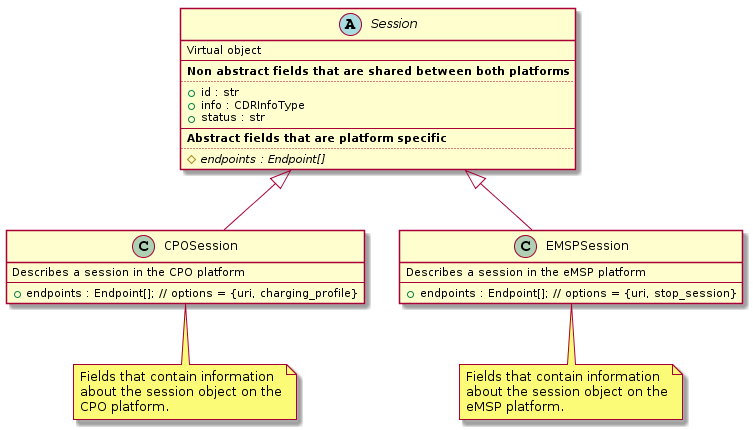
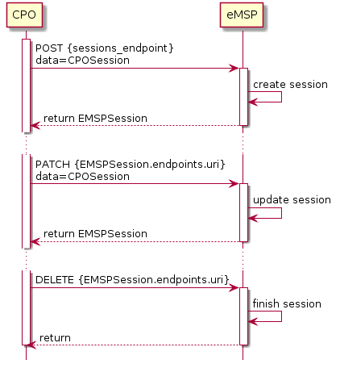

# _Sessions_ module

**Module Identifier: sessions**

The session object describes one charging session in a roaming scenario.
The object is virtual and lives between the operator's and provider's
systems. Each of the two parties hold a inheritance of this virtual
object.


## 1. Inheritances

The generic _Session_ object is a virtual object which describes one
charging session in a roaming case. It inherits into two child
objects, the _CPOSession_ object in the operator system and the
_EMSPSession_ in the provider system. The leading instance is the
_CPOSession_ object. The CPO updates the virtual parent _Session_
object. The _EMSPSession_ object inherits the updates.




### 1.1 Operator Inheritor

The operator inheritance of the session object contains charging station
related data.


### 1.2 Provider Inheritor

The provider inheritance of the session object contains user and billing
related data.


## 2. Flow and Lifecycle

The following sequence diagram illustrates the data flow between
operator an provider:




## 3. Interfaces and endpoints

### 3.1 CPO Interface

Example endpoint structure: `/ocpi/cpo/2.0/sessions/?date_from=xxx&date_to=yyy`

| Method                 | Description                                                                             |
| ---------------------- | --------------------------------------------------------------------------------------- |
| [GET](#311-get-method) | Fetch Session object of charging sessions started between the {date_from} and {date_to} |
| POST                   | n/a                                                                                     |
| PUT                    | n/a                                                                                     |
| PATCH                  | n/a                                                                                     |
| DELETE                 | n/a                                                                                     |


#### 3.1.1 __GET__ Method

Fetch Sessions from the CPO systems. Only Sessions with a start date/time between the given date_from and date_to will be returned.

| Parameter  | Datatype                              | Required | Description                                                                   |
|------------|---------------------------------------|----------|-------------------------------------------------------------------------------|
| date_from  | [DateTime](types.md#12_datetime_type) | yes      | Begin charging session start Date/Time of the Sessions to fetch.                      |
| date_to    | [DateTime](types.md#12_datetime_type) | no       | End charging session start Date/Time of the Sessons to fetch, if omitted all Sessions up to now are request to be returned. |

_NOTE: The CPO is allowed to return a (not specified) maximum amount of Sessions, to prevent overloading there system. In this version of OCPI it is not possible to detect if the CPO returned not all Sessions that match the filter._  

##### Response Data

The response contains a list of Session objects that match the given parameters in the request.
If the CPO returns less Sessions then the amount of Sessions in the system that match the filter, __count__ will be different from __total__ 

| Parameter | Datatype              | Card. | Description                                                                     |
|-------------------------------------------|-------|-------------------------------------------------------------------------|
| Sessions  | [Session](#41-session-object) | *     | List of Session objects that match the request parameters               |
| count     | int                           | 1     | Amount of Sessions returned in this response                            |
| total     | int                           | 1     | Total amount of Sessions that match the filter given in the GET request |


### 3.2 eMSP Interface

Example endpoint structure: `/ocpi/emsp/2.0/sessions/` and
`/ocpi/emsp/2.0/sessions/{session-id}/`

| Method                       | Description                                          |
| ---------------------------- | ---------------------------------------------------- |
| GET                          | n/a                                                  |
| [POST](#321-get-method)      | Send a new _CPOSession_ object                       |
| PUT                          | n/a                                                  |
| [PATCH](#322-patch-method)   | Update the _CPOSession_ object of id {session-id}.   |
| [DELETE](#323-delete-method) | Delete the _CPOSession_ object of id {session-id}.   |


#### 3.2.1 __POST__ Method

Create a new session in the eMSP backoffice by POSTing a _CPOSession_
object.

##### Data

The request contains the new Session Object.

| Type                            | Card. | Description                              |
|---------------------------------|-------|------------------------------------------|
| [Session](#41-session-object)   | 1     | new Session object.                      |


The response contains a _EMSPSession_ object enriched with the
**status** and **endpoints** fields and the **id** field filled.

The endpoints field contains the endpoints relevant to the session that
was created.

##### Example:

```
"endpoints": [
  {"identifier": "uri", "url": "http://msp/sessions/345/"},
  {"identifier": "create_cdr", "url": "http://msp/sessions/345/create_cdr"}
]
```

#### 3.2.2 __PATCH__ Method

Inform about updates in the _Session_ object.

The response will contain the updated _EMSPSession_ object.

##### Parameters

| Parameter  | Datatype                              | Required | Description                               |
|------------|---------------------------------------|----------|-------------------------------------------|
| session-id | [string](types.md#16-string-type)(15) | yes      | ID of the Session to be updated           |

##### Data

The request contains the Session Object to be updated.

| Type                            | Card. | Description                              |
|---------------------------------|-------|------------------------------------------|
| [Session](#41-session-object)   | 1     | new Session object.                      |


#### 3.2.3 __DELETE__ Method

Inform about a deleted _Session_ object.

##### Parameters

| Parameter  | Datatype                              | Required | Description                               |
|------------|---------------------------------------|----------|-------------------------------------------|
| session-id | [string](types.md#16-string-type)(15) | yes      | ID of the Session to be deleted           |


## 4. Object description

### 4.1 _Session_ Object

| Property          | Type                                                       | Card. | Description                                                                                                    |
|-------------------|------------------------------------------------------------|-------|----------------------------------------------------------------------------------------------------------------|
| id                | [string](types.md#16-string-type)(15)                      | 1     | The unique id that identifies the session in the CPO platform.                                                 |
| start_datetime    | [DateTime](types.md#12_datetime_type)                      | 1     | The time when the session became active.                                                                       |
| end_datetime      | [DateTime](types.md#12_datetime_type)                      | ?     | The time when the session is completed.                                                                        |
| kwh               | [decimal](types.md#13_decimal_type)                        | 1     | How many kWh are charged.                                                                                      |
| auth_id           | [string](types.md#16-string-type)(15)                      | 1     | An id provided by the authentication used, so that the eMSP knows to which driver the session belongs.         |
| auth_method       | [AuthMethod](mod_cdrs.md#51-authmethod-enum)               | 1     | Method used for authentication.                                                                                |
| location          | [Location](mod_locations_and_evses.md#41-location-object)  | 1     | The location where this session took place.                                                                    |
| evse              | [EVSE](mod_locations_and_evses.md#42-evse-object)          | 1     | The EVSE that was used for this session.                                                                       |
| connector_id      | [string](types.md#16-string-type)(15)                      | 1     | Connector ID of the connector used at the EVSE.                                                                |
| meter_id          | [string](types.md#16-string-type)(255)                     | ?     | Optional identification of the kWh meter.                                                                      |
| currency          | [string](types.md#16-string-type)(3)                       | 1     | ISO 4217 code of the currency used for this session.                                                           |
| charging_periods  | [ChargingPeriod](mod_cdrs.md#53-chargingperiod-class)      | *     | An optional list of charging periods that can be used to calculate and verify the total cost.                  |
| total_cost        | [decimal](types.md#13_decimal_type)                        | 1     | The total cost (excluding VAT) of the session in the specified currency. This is the price that the eMSP will have to pay to the CPO. |
| status            | [SessionStatus](#51-sessionstatus-enum)                    | 1     | The status of the session.                                                                                     |

#### Examples

#### Simple Session example of a just starting session

```json
{
	"id": "101",
	"start_datetime": "2015-06-29T22:39:09+02:00",
	"kwh": "0.00",
	"auth_id": "FA54320",
	"location": {
		"id": "LOC1",
		"type": "on_street",
		"name": "Gent Zuid",
		"address": "F.Rooseveltlaan 3A",
		"city": "Gent",
		"postal_code": "9000",
		"country": "BE",
		"coordinates": {
			"latitude": "3.72994",
			"longitude": "51.04759"
		}
	},
	"evse": {
		"evse_id": "BE-BEC-E041503003",
		"location_id": "LOC1",
		"STATUS": "AVAILABLE",
		"connectors": [{
			"id": "1",
			"standard": "IEC-62196-T2",
			"format": "SOCKET",
			"power_type": "AC_1_PHASE",
			"voltage": "230",
			"amperage": "64",
			"tariff_id": "11"
		}]
	},
	"connector_id": "1",
	"currency": "EUR",
	"total_cost": "2.50",
	"status": "PENDING"
}
```

##### Simple Session example of a short finished session

```json
{
	"id": "101",
	"start_datetime": "2015-06-29T22:39:09+02:00",
	"end_datetime": "2015-06-29T23:50:16+02:00",
	"kwh": "0.00",
	"auth_id": "FA54320",
	"location": {
		"id": "LOC1",
		"type": "on_street",
		"name": "Gent Zuid",
		"address": "F.Rooseveltlaan 3A",
		"city": "Gent",
		"postal_code": "9000",
		"country": "BE",
		"coordinates": {
			"latitude": "3.72994",
			"longitude": "51.04759"
		}
	},
	"evse": {
		"evse_id": "BE-BEC-E041503003",
		"location_id": "LOC1",
		"STATUS": "AVAILABLE",
		"connectors": [{
			"id": "1",
			"standard": "IEC-62196-T2",
			"format": "SOCKET",
			"power_type": "AC_1_PHASE",
			"voltage": "230",
			"amperage": "64",
			"tariff_id": "11"
		}]
	},
	"connector_id": "1",
	"currency": "EUR",
	"charging_periods": [{
		"charging_periods": "2015-06-29T22:39:09+02:00",
		"dimensions": [{
			"type": "energy",
			"volume": "120"
		}, {
			"type": "max_current",
			"volume": "30"
		}]
	}, {
		"charging_periods": "2015-06-29T22:40:54+02:00",
		"dimensions": [{
			"type": "energy",
			"volume": "41000"
		}, {
			"type": "min_current",
			"volume": "34"
		}]
	}, {
		"charging_periods": "2015-06-29T23:07:09+02:00",
		"dimensions": [{
			"type": "parking_time",
			"volume": "2585"
		}]
	}],
	"total_cost": "8.50",
	"status": "COMPLETED"
}
```


### 4.2 _CPOSession_ Object

Describes a session in the CPO platform

| Property  | Type                                                       | Card. | Description                    |
|-----------|------------------------------------------------------------|-------|--------------------------------|
| endpoints | [Endpoint](version_information_endpoint.md#endpoint-class) | *     |                                |
|           |                                                            |       |                                |


### 4.3 _EMSPSession_ Object

Describes a session in the eMSP platform

| Property  | Type                                                       | Card. | Description                    |
|-----------|------------------------------------------------------------|-------|--------------------------------|
| endpoints | [Endpoint](version_information_endpoint.md#endpoint-class) | *     |                                |
|           |                                                            |       |                                |


## 5. Data types

*Describe all datatypes used in this object*

### 5.1 SessionStatus *enum*

| Property  | Description                                                                |
|-----------|----------------------------------------------------------------------------|
| PENDING   | The session is pending and has not yet started. This is the initial state. |
| ACTIVE    | The session is accepted and active.                                        |
| COMPLETED | The session has finished succesfully.                                      |
| INVALID   | The session is declared invalid and will not be billed.                    |

