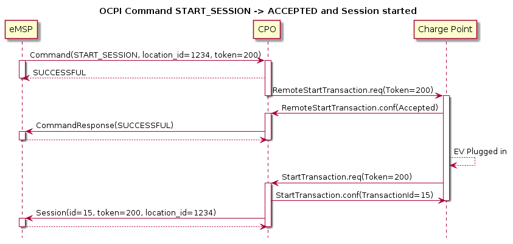

# _Commands_ module

**Module Identifier: `commands`**

The Commands module enables remote commands to be sent to a Location/EVSE.
The following commands are supported: 
- `RESERVE_NOW`
- `START_SESSION`
- `STOP_SESSION`
- `UNLOCK_CONNECTOR`

See [CommandType](#42-commandtype-enum) for a description of the different commands.
_Use the `UNLOCK_CONNECTOR` command with care, please read the note at [CommandType](#42-commandtype-enum)._ 

**Module dependency:** [Locations module](mod_locations.md#locations-module), [Sessions module](mod_sessions.md#sessions-module)

## 1. Flow

With the Commands module, commands can be sent from the eMSP, via the CPO to a Charge Point.
Most Charge Point are hooked up to the internet via a relative slow wireless connection. To prevent long blocking calls, the commands module is designed to work asynchronously.
 
The eMSP send a request to a CPO, via the CPO Commands interface. The CPO checks if it can send the request to a Charge Point and will respond to the request with a status, indicating if the request can be sent to a Charge Point. 

The CPO sends the requested command (via another protocol, for example: OCPP) to a Charge Point. The Charge Point will respond if it understands the command and will try to execute the command. This response doesn't mean that the command was executed successfully. The CPO will forward this command in a new POST request to the eMSP Commands interface.  

The following examples try to give insight into the message flow and the asynchronous nature of the OCPI Commands.
Example of a `UNLOCK_CONNECTOR` that fails because the Location is not known by the CPO.

Example of a `RESERVE_NOW` that is rejected by the Charge Point.

<!--
  Add some whitelines for PDF generation fix, TODO check in new PDf versions 
-->

&nbsp;

&nbsp;

&nbsp;

&nbsp;

<!--
  Add some whitelines for PDF generation fix, TODO check in new PDf versions 
-->

Example of a `START_SESSION` that is accepted, but no new Session is started because EV not plugged in before end of time-out.

Example of a `START_SESSION` that is accepted and results in a new Session.

_These examples use OCPP 1.6 based commands between CPO and Charge Point, but that is not a requirement for OCPI._

## 2. Interfaces and endpoints

The commands module consists of two interfaces: a CPO interface that enables a eMSP (and its clients) to send commands to a Charge Point and an eMSP interface to receive the response from the Charge Point asynchronously.

### 2.1 CPO Interface

Example endpoint structure: `/ocpi/cpo/2.0/commands/{command}`

<!-- ---------------------------------------------------------------------------- -->

| Method                   | Description                                          |
|--------------------------|------------------------------------------------------|
| GET                      | n/a                                                  |
| [POST](#211-post-method) | Send a command to the CPO, requesting the CPO to send the command to the Charge Point |
| PUT                      | n/a                                                  |
| PATCH                    | n/a                                                  |
| DELETE                   | n/a                                                  |

<!-- ---------------------------------------------------------------------------- -->

<!--
  Add some whitelines for PDF generation fix, TODO check in new PDf versions 
-->

&nbsp;

&nbsp;

&nbsp;

&nbsp;

&nbsp;

<!--
  Add some whitelines for PDF generation fix, TODO check in new PDf versions 
-->

#### 2.1.1 __POST__ Method

##### Request Parameters

The following parameters can be provided as URL segments.

<!-- ---------------------------------------------------------------------------- -->

| Parameter   | Datatype                                    | Required | Description                                                                   |
|-------------|---------------------------------------------|----------|-------------------------------------------------------------------------------|
| command     | [CommandType](#42-commandtype-enum) | yes      | Type of command that is requested.                                            |

<!-- ---------------------------------------------------------------------------- -->

##### Request Body

Depending on the `command` parameter the body SHALL contain the applicable object for that command. 

<!-- ---------------------------------------------------------------------------- -->

| Type                                            | Card. | Description                                            |
|-------------------------------------------------|-------|--------------------------------------------------------|
| *Choice: one of four*                           |       |                                                        |
| > [ReserveNow](#32-reservenow-object)           | 1     | ReserveNow object, for the `RESERVE_NOW` command, with information needed to reserve a (specific) connector of a Charge Point for a given Token. |
| > [StartSession](#33-startsession-object)       | 1     | StartSession object, for the `START_SESSION` command, with information needed to start a sessions.                                               |
| > [StopSession](#34-stopsession-object)         | 1     | StopSession object, for the `STOP_SESSION` command, with information needed to stop a sessions.                                                  |
| > [UnlockConnector](#35-unlockconnector-object) | 1     | UnlockConnector object, for the `UNLOCK_CONNECTOR` command, with information needed to unlock a connector of a Charge Point.                     |

<!-- ---------------------------------------------------------------------------- -->

##### Response Data

The response contains the direct response from the CPO, not the response from the Charge Point itself, that will be sent via an asynchronous POST on the eMSP interface if this response is `ACCEPTED`.

<!-- ---------------------------------------------------------------------------- -->

| Datatype                                            | Card. | Description                                                              |
|-----------------------------------------------------|-------|--------------------------------------------------------------------------|
| [CommandResponse](#31-commandresponse-object)       | 1     | Result of the command request, by the CPO (not the Charge Point). So this indicates if the CPO understood the command request and was able to send it to the Charge Point. This is not the response by the Charge Point |

<!-- ---------------------------------------------------------------------------- -->

### 2.2 eMSP Interface

The eMSP interface receives the asynchronous responses.

Example endpoint structure: 
`/ocpi/emsp/2.0/commands/{command}`
`/ocpi/emsp/2.0/commands/{command}/{uid}`

<!-- ---------------------------------------------------------------------------- -->

| Method                   | Description                                              |
|--------------------------|----------------------------------------------------------|
| GET                      | n/a                                                      |
| [POST](#221-post-method) | Receive the asynchronous response from the Charge Point. |
| PUT                      | n/a                                                      |
| PATCH                    | n/a                                                      |
| DELETE                   | n/a                                                      |

<!-- ---------------------------------------------------------------------------- -->

<!--
  Add some whitelines for PDF generation fix, TODO check in new PDf versions 
-->

&nbsp;

&nbsp;

&nbsp;

&nbsp;

<!--
  Add some whitelines for PDF generation fix, TODO check in new PDf versions 
-->

#### 2.2.1 __POST__ Method

##### Request Parameters

There are no URL segment parameters required by OCPI. 
It is up to the implementation of the eMSP  to determine what parameters are put in the URL. The eMSP sends a URL in the POST method body to the CPO. The CPO is required to use this URL for the asynchronous response by the Charge Point. It is advised to make this URL unique for every request to differentiate simultanous commands, for example by adding a unique id as a URL segment.  

Example: 
`/ocpi/emsp/2.0/commands/RESERVE_NOW/1234`
`/ocpi/emsp/2.0/commands/UNLOCK_CONNECTOR/2`

##### Request Body

The request body contains the result of the command.

<!-- ---------------------------------------------------------------------------- -->

| Datatype                                            | Card. | Description                                                              |
|-----------------------------------------------------|-------|--------------------------------------------------------------------------|
| [CommandResponse](#31-commandresponse-object)       | 1     | Result of the command request, from the Charge Point.         |

<!-- ---------------------------------------------------------------------------- -->

## 3. Object description

### 3.1 _CommandResponse_ Object

<!-- ---------------------------------------------------------------------------- -->

| Property         | Type                                                | Card. | Description                                                           |
|------------------|-----------------------------------------------------|-------|-----------------------------------------------------------------------|
| result           | [CommandResponseType](#41-commandresponsetype-enum) | 1     | Result of the command request as sent by the Charge Point to the CPO. |

<!-- ---------------------------------------------------------------------------- -->

### 3.2 _ReserveNow_ Object

The `evse_uid` is optional. If no EVSE is specified, the Charge Point should keep one EVSE available for the EV Driver identified by the given Token. (This might not be supported by all Charge Points).
A reservation can be replaced/updated by sending a `RESERVE_NOW` request with the same Location (Charge Point) and the same `reservation_id`. 

<!-- ---------------------------------------------------------------------------- -->

| Property                     | Type                                   | Card. | Description                                                                                                                                     |
|------------------------------|----------------------------------------|-------|-------------------------------------------------------------------------------------------------------------------------------------------------|
| response_url                 | [URL](types.md#16-url-type)            | 1     | URL that the CommandResponse POST should be send to. This URL might contain an unique ID to be able to distinguish between ReserveNow requests. |
| token                        | [Token](mod_tokens.md#32-token-object) | 1     | Token object for how to reserve this Charge Point (and specific EVSE).                                                                          |
| expiry_date                  | [DateTime](types.md#12-datetime-type)  | 1     | The Date/Time when this reservation ends.                                                                                                       |
| reservation_id               | int                                    | 1     | Reservation id, unique for this reservation. If the Charge Point already has a reservation that matches this reservationId the Charge Point will replace the reservation. |
| location_id                  | [string](types.md#15-string-type)(39)  | 1     | Location.id of the Location (belonging to the CPO this request is send to) for which to reserve an EVSE.                                        |
| evse_uid                     | [string](types.md#15-string-type)(39)  | ?     | Optional EVSE.uid of the EVSE of this Location if a specific EVSE has to be reserved.                                                           |

<!-- ---------------------------------------------------------------------------- -->

<!--
  Add some whitelines for PDF generation fix, TODO check in new PDf versions 
-->

&nbsp;

&nbsp;

&nbsp;

&nbsp;

<!--
  Add some whitelines for PDF generation fix, TODO check in new PDf versions 
-->

### 3.3 _StartSession_ Object

The `evse_uid` is optional. If no EVSE is specified, the Charge Point can itself decide on which EVSE to start a new session. (this might not be supported by all Charge Points).

<!-- ---------------------------------------------------------------------------- -->

| Property                 | Type                                   | Card. | Description                                                                                                                                       |
|--------------------------|----------------------------------------|-------|---------------------------------------------------------------------------------------------------------------------------------------------------|
| response_url             | [URL](types.md#16-url-type)            | 1     | URL that the CommandResponse POST should be sent to. This URL might contain an unique ID to be able to distinguish between StartSession requests. |
| token                    | [Token](mod_tokens.md#32-token-object) | 1     | Token object the Charge Point has to use to start a new session.                                                                                  |
| location_id              | [string](types.md#15-string-type)(39)  | 1     | Location.id of the Location (belonging to the CPO this request is send to) on which a session is to be started.                                   |
| evse_uid                 | [string](types.md#15-string-type)(39)  | ?     | Optional EVSE.uid of the EVSE of this Location on which a session is to be started.                                                               |

<!-- ---------------------------------------------------------------------------- -->

### 3.4 _StopSession_ Object

<!-- ---------------------------------------------------------------------------- -->

| Property                 | Type                                   | Card. | Description                                                                                                                                      |
|--------------------------|----------------------------------------|-------|--------------------------------------------------------------------------------------------------------------------------------------------------|
| response_url             | [URL](types.md#16-url-type)            | 1     | URL that the CommandResponse POST should be sent to. This URL might contain an unique ID to be able to distinguish between StopSession requests. |
| session_id               | [string](types.md#15-string-type)(36)  | 1     | Session.id of the Session that is requested to be stopped.                                                                                       |         

<!-- ---------------------------------------------------------------------------- -->

### 3.5 _UnlockConnector_ Object

<!-- ---------------------------------------------------------------------------- -->

| Property                 | Type                                   | Card. | Description                                                                                                                                          |
|--------------------------|----------------------------------------|-------|------------------------------------------------------------------------------------------------------------------------------------------------------|
| response_url             | [URL](types.md#16-url-type)            | 1     | URL that the CommandResponse POST should be sent to. This URL might contain an unique ID to be able to distinguish between UnlockConnector requests. |
| location_id              | [string](types.md#15-string-type)(39)  | 1     | Location.id of the Location (belonging to the CPO this request is send to) of which it is requested to unlock the connector.                         |
| evse_uid                 | [string](types.md#15-string-type)(39)  | 1     | EVSE.uid of the EVSE of this Location of which it is requested to unlock the connector.                                                              |
| connector_id             | [string](types.md#15-string-type)(36)  | 1     | Connector.id of the Connector of this Location of which it is requested to unlock.                                                                   |

<!-- ---------------------------------------------------------------------------- -->

## 4. Data types

### 4.1 CommandResponseType *enum*

The response/result of the requested command.

<!-- ---------------------------------------------------------------------------- -->

| Value                       | Description                                                                                |
|-----------------------------|--------------------------------------------------------------------------------------------|
| NOT_SUPPORTED               | The requested command is not supported by this CPO, Charge Point, EVSE etc.                |
| REJECTED                    | Command request rejected by the CPO or Charge Point.                                       |
| ACCEPTED                    | Command request accepted by the CPO or Charge Point.                                       |
| TIMEOUT                     | Command request timeout, no response received from the Charge Point in an reasonable time. |
| UNKNOWN_SESSION             | The Session in the requested command is not known by this CPO.                             |

<!-- ---------------------------------------------------------------------------- -->

<!--
  Add some whitelines for PDF generation fix, TODO check in new PDf versions 
-->

&nbsp;

&nbsp;

&nbsp;

<!--
  Add some whitelines for PDF generation fix, TODO check in new PDf versions 
-->

### 4.2 CommandType *enum*

The command requested.

<!-- ---------------------------------------------------------------------------- -->

| Value                 | Description |
|-----------------------|-------------------------------------------------------------------|
| RESERVE_NOW           | Request the Charge Point to reserve a (specific) EVSE for a Token for a certain time, starting now.                                |
| START_SESSION         | Request the Charge Point to start a transaction on the given EVSE/Connector.                                         |
| STOP_SESSION          | Request the Charge Point to stop an ongoing session.                                                                  |
| UNLOCK_CONNECTOR      | Request the Charge Point to unlock the connector (if applicable). This functionality is for help desk operators only! |

<!-- ---------------------------------------------------------------------------- -->

**The command `UNLOCK_CONNECTOR` may only be used by an help desk operator working for the eMSP. This command SHALL never be allowed to be sent directly by the EV-Driver. 
The `UNLOCK_CONNECTOR` is intended to be used in the rare situation that the connector is not unlocked successfully after a transaction is stopped. The mechanical unlock of the lock mechanism might get stuck, for example: fail when there is tension on the charging cable when the Charge Point tries to unlock the connector.
In such a situation the EV-Driver can call either the CPO or the eMSP to retry the unlocking.** 

